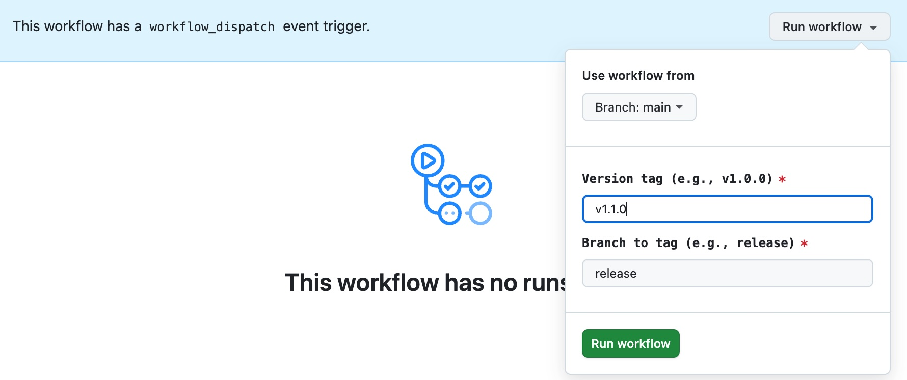

# HM Color Palette

A WordPress plugin that adds customizable color palette meta data or block attribute functionality for posts and pages.

## Description

This plugin allows you to assign color palettes to individual posts and pages, which can then be used to style your content dynamically. It provides:

- Post meta for storing color palette selection
- React component for the block editor sidebar
- Support for using the component in blocks with block attributes
- Body class based on selected palette color
- Developer-friendly customization via a filter that can be used in theme files

## Features

- **Easy Integration**: Works with any theme or block
- **Customizable Palettes**: Define your own color schemes via code or theme.json color palette
- **Block Editor Component**: Ready-to-use React component with `@humanmade/block-editor-components`
- **Body Classes**: Adds palette-specific classes for additional styling
- **Document & Block Level**: Can be used for entire documents or individual blocks

## Installation

### For Development
1. Clone or download to `/wp-content/plugins/hm-color-palette/`
2. Run `npm install && npm run build`
3. Activate the plugin in WordPress

### For Production
1. Download from the release
2. Upload to `/wp-content/plugins/hm-color-palette/`
3. Activate the plugin in WordPress

## Managing Color Palettes

This plugin uses the theme color palette defined in the active theme's theme.json by default. Developers can also customize the palette programmatically using the `hm_color_palette_options` filter:

```php
add_filter( 'hm_color_palette_options', function( $palette ) {
  // Add a new color.
  $palette[] = [
    'color' => '#000000',
    'name'  => 'Black',
    'slug'  => 'black'
  ];

  // Remove a color without removing from theme.json.
  $item_to_remove = array_find_key( $palette, function ( $value ) {
    return $value['slug'] === 'white';
  } );
  unset( $palette[$item_to_remove] );
  $palette = array_values($palette);
    
  return $palette;
} );
```

### Palette Structure

Each palette must be structured like the theme.json color object:

```json
[
  {
    "color": "#000000",
    "name": "Black",
    "slug": "black"
  },
]
```

## Usage

### Document-Level Color Palette (Post/Page Meta)

A block editor sidebar panel is included with this plugin to set the color at the page/post level. Using the color palette from the included block editor sidebar panel will save the color to post meta and add a class to the page/post body element on the frontend.

### Using In Custom Blocks To Set Color At The Block Level

Add color palette selection to individual blocks:

```javascript
import { HMColorPalette } from 'hm-color-palette';
import { useBlockProps, InspectorControls } from '@wordpress/block-editor';
import { PanelBody } from '@wordpress/components';
import { __ } from '@wordpress/i18n';

function Edit({ attributes, setAttributes }) {
  const { colorPalette } = attributes;
  
  const blockProps = useBlockProps({
    className: `has-${ colorPalette }-color-palette`,
  });

  return (
    <>
      <InspectorControls>
        <PanelBody title={__('Color Settings', 'your-textdomain')}>
          <HMColorPalette
            blockColorPalette={colorPalette}
            setBlockColorPalette={(value) => setAttributes({ colorPalette: value })}
          />
        </PanelBody>
      </InspectorControls>
      
      <div {...blockProps}>
        Your content here
      </div>
    </>
  );
}
```

**block.json:**
```json
{
  "attributes": {
    "colorPalette": {
      "type": "string",
      "default": null
    }
  }
}
```

**save.js:**
```javascript
import { useBlockProps } from '@wordpress/block-editor';

export default function save({ attributes }) {
  const { colorPalette } = attributes;
  
  const blockProps = useBlockProps.save({
    className: `has-${ colorPalette }-color-palette`,
  });

  return (
    <div {...blockProps}>
      Your content here
    </div>
  );
}
```

### Using in Themes

#### 1. PHP Integration

The plugin automatically injects body classes. Access the selected palette in your theme:

```php
<?php
// Get the current post's color palette.
$palette = get_post_meta( get_the_ID(), 'document_color_palette', true );

// Check if a specific palette is selected.
if ( 'primary' === $palette ) {
  // Do something specific for primary palette.
}

// The body class is automatically added: has-{palette}-color-palette
// Example: has-primary-color-palette, has-secondary-color-palette
```

#### 2. CSS Styling in Themes

```css
/* Target specific palettes using body classes */
body.has-primary-color-palette .special-element {
  /* Styles specific to primary palette */
}

body.has-secondary-color-palette .special-element {
  /* Styles specific to secondary palette */
}
```

## Development

### Setup
```bash
npm install
composer install
```

### Build
```bash
npm run build
```

### Development Mode
```bash
npm start
```

## Release Process

Merges to `main` will automatically [build](https://github.com/humanmade/hm-color-palette/actions/workflows/build-release-branch.yml) to the `release` branch. A project may be set up to track the `release` branch using [composer](http://getcomposer.org/) to pull in the latest built beta version.

Commits on the `release` branch may be tagged for installation via [packagist](https://packagist.org/packages/humanmade/hm-color-palette) and marked as releases in GitHub for manual download using a [manually-dispatched "Tag and Release" GH Actions workflow](https://github.com/humanmade/hm-color-palette/actions/workflows/tag-and-release.yml).

To tag a new release,

1. Review the unreleased features in the [Changelog](./CHANGELOG.md) and choose the target version number for the next release using [semantic versioning](https://semver.org/)
2. Checkout a `prepare-v#.#.#` branch. In that branch,
   - Add a new header into [CHANGELOG.md](./CHANGELOG.md) for any unreleased features
   - Bump the version number in the [hm-color-palette.php](./hm-color-palette.php) file's PHPDoc header
3. Open a pull request from your branch titled "Prepare release v#.#.#"
4. Review and merge your "Prepare release" pull request
5. Wait for the `release` branch to [update](https://github.com/humanmade/hm-color-palette/actions/workflows/build-release-branch.yml) with the build that includes the new version number
6. On the ["Tag and Release" GH Action page](https://github.com/humanmade/hm-color-palette/actions/workflows/tag-and-release.yml)],
   - Click the "Run workflow" button in the "workflow_dispatch" notification banner (see screenshot below)
   - Fill out the "Version tag" field with your target version number
    - This version must match the version in `hm-color-palette.php` and your newest Changelog section
    - Use the format `v#.#.#` for your version tag
   - Leave the "Branch to tag" field as `release` (we will add the tag on the release branch containing the latest built code)
   - Click "Run workflow"



Once the workflow completes, your new version should be [tagged](https://github.com/humanmade/hm-carousel-block/tags) and available in the list of [releases](https://github.com/humanmade/hm-carousel-block/releases)

## Requirements

- WordPress 5.8+
- PHP 7.4+
- Node.js 20.10+

## License

GPL-2.0-or-later

## Author

Human Made Limited - https://humanmade.com
